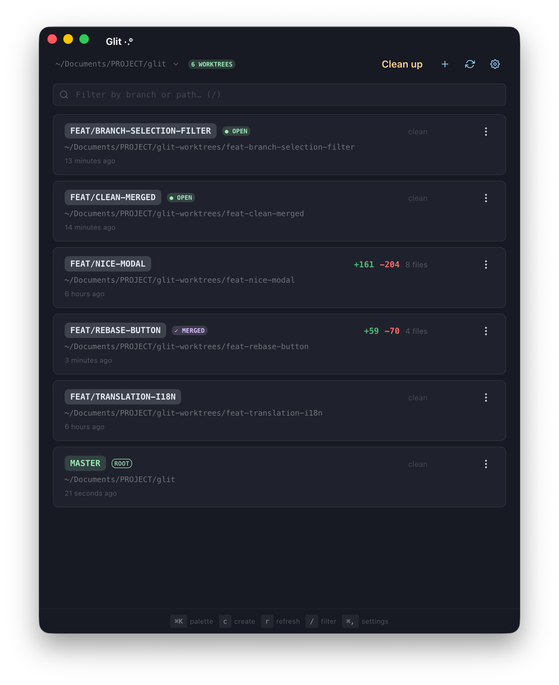

# Glit ·.° git worktree manager

Glit manages your worktree and allow you to quickly switch between them.



I've been frustrated by how useful worktree can be, while at the same time being so hard to use. Existing wrappers either felt incomplete or where locking in too many things behind their tooling (claude code, cursor to name a few).

While humanly reviewed, this tool was mostly generated from various AI tools. I've reached a stage where I love using Glit to continue working on Glit and my other projects, so that might be a sign that it can be useful to some people!

## Features
- list all your worktree, with their branch and a solid overview of the diff
- delete your unused wortree cleanly
- spin up new worktrees with ease (and with a configurable setup script in .glit/setup.yaml)
	- setup.yaml allows you to install packages, copy .env files, or do whatever you want really
- copy the path of the worktree or open a new terminal session for the worktree in the terminal of your choice


## Build

```bash
# Install dependencies
npm install

# Build the app (creates a .dmg installer in release/)
npm run build
```


## Install

After building, install the DMG:

```bash
# Open the dmg and drag Glit to Applications
open release/*.dmg
```

Or install globally via npm to use `glit` from anywhere:

```bash
npm run install:global
```


## Usage

```bash
# From within a git repo
glit

# Or specify a directory
glit /path/to/repo
```

The glit window will open for the current repo

## How to release

```bash
git tag v0.2.0
git push origin v0.2.0
```

## Stack
- Electron
- Strict Typescript
- React compiler + ChakraUI
